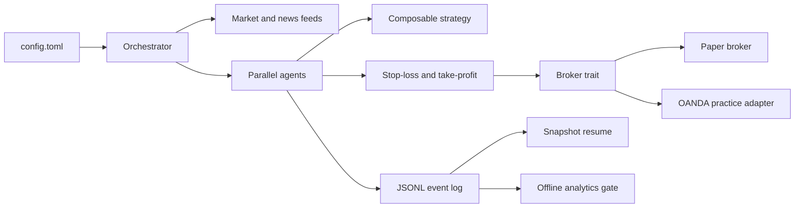

<p align="center">
  
</p>

<p align="center">
  <strong>YTrader — a Rust-native multi-agent FX trading laboratory</strong><br>
  Compose independent strategies, enforce risk outside the strategy layer,
  resume from snapshots, and measure results before touching a practice account.
</p>

<p align="center">
  <a href="https://github.com/YousriD/YTrader/stargazers"></a>
  <a href="https://www.rust-lang.org/"></a>
  <a href="https://github.com/YousriD/YTrader"></a>
</p>

YTrader is an educational, paper-first workspace for experimenting with
multi-agent trading infrastructure. Every external dependency — broker, price
feed, news source, and strategy "brain" — sits behind a trait in `core`. Run
the full agent lifecycle locally with no external accounts or API keys
required, then use analytics and an OANDA practice adapter as deliberate
promotion steps.

> **This is not investment advice and it does not claim to be profitable.**
> YTrader is a transparent engineering laboratory for broker semantics,
> risk controls, persistence, strategy composition, and measurable evaluation.

## Why YTrader?

| Capability | YTrader |
|---|---:|
| Independent agents running in parallel | Yes |
| Rust-native extension points | Yes |
| Risk layer outside the strategy | Yes |
| Config-driven strategy registry | Yes |
| Paper margin and venue economics | Yes |
| Snapshot-based crash resume | Yes |
| Offline performance and promotion gate | Yes |
| OANDA practice integration | Yes |
| Real-money execution | Intentionally disabled |

The project favors honest semantics over impressive-looking backtests:
paper fills model exposure margin, spread, commission, minimums, and
cash-only withdrawals; analytics can reject a run instead of marketing it.

## See it run

The default configuration starts multiple agents, emits events, and writes an
append-only run log:

```text
$ cargo run -p orchestrator

algo-fast: OrderPlaced Buy EUR_USD
algo-slow: OrderRejected insufficient margin
algo-fast: StopLoss EUR_USD
algo-fast: Split withdrawn=50% baseline reset
Final algo-fast: equity=... lagged=0/0
```

Your prices and outcomes will differ because the mock feed is stochastic.
That is intentional: use the output to inspect lifecycle behavior, not to
cherry-pick a profitable run.

## Quick start

```bash
cargo build -p orchestrator
cargo test
cargo run -p orchestrator          # reads ./config.toml by default
cargo run -p orchestrator my-config.toml
```

Agents are now defined entirely in `config.toml` — no code changes or
recompiling needed to add, remove, or retune an agent. Edit the file,
run again.

To also run the LLM-driven agent defined in the sample config:

```bash
export ANTHROPIC_API_KEY=sk-ant-...
cargo run -p orchestrator
```

Every event (order, stop-loss, take-profit, split, death) is printed
to the console **and** durably appended to `data/run-<timestamp>.jsonl`
as it happens. Agents also checkpoint restorable snapshots every
`snapshot_every_n_ticks` — restart with `--resume` to rebuild
broker/baseline state from the newest log instead of fresh stakes:

```bash
cargo run -p orchestrator -- config.toml --resume
```

Analyze a completed run without affecting execution:

```bash
cargo run -p analytics -- report data/run-<timestamp>.jsonl
cargo run -p analytics -- gate data/run-<timestamp>.jsonl
cargo run -p analytics -- track data/run-<timestamp>.jsonl
```

`mode = "live"` is a guarded OANDA **practice-mode** path. The trade host,
missing credentials, shared symbols, or a failed opening reconcile abort the
run. Paper mode remains the default.

## Architecture



The important boundary is `Strategy -> Risk -> Broker`: strategies decide,
the runtime owns safety exits, and brokers own fills and account semantics.
This keeps an unavailable LLM from bypassing risk controls and lets new
strategies or venues plug into the same lifecycle.

## Feature status

| Feature | Status |
|---|---|
| Paper broker with exposure margin | Done |
| Stop-loss, take-profit, death, and split lifecycle | Done |
| SMA, RSI, Donchian, ATR, and news-gated strategies | Done |
| Multi-symbol feeds and lag accounting | Done |
| Snapshot resume and JSONL audit log | Done |
| Performance report, tracker, and promotion gate | Done |
| OANDA practice adapter with fail-closed reconcile | Done |
| Economic-calendar feed and calendar gate | Done |
| Headline APIs and LLM sentiment | Planned |
| Real-money execution | Disabled by design |

## Contributing

Good first contributions include:

- Add a `Strategy`, `MarketFeed`, or `NewsFeed` implementation.
- Add property tests for broker fills, margin, or lifecycle transitions.
- Improve analytics reports or add visualizations for run logs.
- Add small, reproducible example configurations.
- Improve documentation while preserving the paper-first safety boundary.

Start with [`docs/CODEMAP.md`](docs/CODEMAP.md), then read
[`docs/PLAN.md`](docs/PLAN.md) before changing runtime behavior. Run
`cargo test` and `cargo build -p orchestrator` before opening a pull request.

## Workspace layout

| Crate | Role |
|---|---|
| `core` | Trait definitions: `Broker` (+`withdraw`, `reconcile`), `MarketFeed`, `NewsFeed`, `Strategy`. The whole extension contract. |
| `broker-paper` | Simulated fills with spread + 1x exposure margin (both sides, closes always pass), correct flip-entry averaging, cash-only `withdraw()`, and venue economics (`min_units` / `min_notional` / per-fill commission / spread override). 12 unit tests. |
| `broker-oanda` | REAL adapter, practice-host only: market orders, mirror + genuine `reconcile()`, hedged positions refused, key redacted in logs. 8 tests + 1 ignored live check. |
| `broker-mt5` + `mt5-sidecar/` + `bridge-mt5/` | MT5 demo via localhost bridge: Rust adapter (units↔lots, DEMO-only reconcile), Rust loopback sidecar, and a native MT5 Expert Advisor. The EA refuses non-demo accounts and starts observation-only until `EnableOrders` is explicitly enabled. Your MT login stays in the terminal; yTrader never sees it. |
| `feed-mock` | Random-walk price generator, no network needed. |
| `news-mock` | Emits sample headlines with sentiment scores periodically. |
| `news-calendar` | REAL economic calendar (free keyless weekly JSON): High-impact event times as headline items, failures degrade to silence. |
| `strategy-sma` | Algorithmic baseline: fast/slow SMA crossover, inventory-guarded (no pyramiding by default). |
| `strategy-indicators` | Registry: RSI mean-reversion, Donchian breakout, ATR volatility sizer, news gate — all sharing the same no-pyramid/size-clamp guards, composable per agent in `config.toml`. |
| `strategy-router` | Tier 2 regime router: deterministic rule brain by default, optional LLM brain (degrades to rules), picks among tested candidates with warm-keeping; switches logged as regime events. |
| `strategy-llm` | Calls an LLM every N ticks, with its own failure backoff/cooldown. |
| `strategy-hybrid` | Wraps an LLM strategy with an algorithmic fallback — the "AI unreachable" guarantee lives here. |
| `agent-runtime` | Agent lifecycle: stop-loss/take-profit risk layer (runs before strategy), die-at-zero, split-at-double via real `broker.withdraw()` (single-fire; defers while profit is unrealized), reconcile-on-startup hook. 6 unit tests. |
| `persistence` | Append-only JSONL event log — durability and audit trail. |
| `trading-config` | Parses `config.toml` into typed agent specs. |
| `licensing` | Currently a no-op seam — the hook where real license enforcement goes before you sell this. |
| `orchestrator` | Binary: loads config, builds the agent pool, runs everything as parallel tokio tasks, logs + persists. |
| `analytics` | Offline stats over run logs: per-agent + portfolio metrics, demo→live promotion gate, log-tailing tracker. Never touches live trading. |

## The rules you specified, and where they live

- **Start with $10–$100:** `stake_min`/`stake_max` per agent in `config.toml`.
- **Die at zero:** `agent-runtime::Agent::on_tick` — checked before and after every order.
- **Split 50/50 at double:** same function, backed by a real `Broker::withdraw()` that reduces broker cash. Baseline becomes post-withdraw equity so the milestone fires once per doubling. Cash-only: while a winner is still open (profit unrealized), the split defers with an `OrderRejected` notice instead of inventing cash — close first, then split.
- **Stop-loss / take-profit:** `agent-runtime::Agent::check_risk_exits` — runs *before* the strategy is consulted each tick, independent of whatever the strategy decided. Set per-agent in config; omit to disable.
- **TEST vs LIVE:** `trading_config::Mode`. `mode = "live"` currently refuses to run (`exit 1`) because only `PaperBroker` exists — paper fills must never be mistaken for real execution. See `docs/PLAN.md:P0-3`.
- **AI unreachable/rate-limited → system keeps operating:** `strategy-llm` tracks consecutive failures and enters a cooldown (no more API calls for N ticks) rather than hanging or erroring. `strategy-hybrid` wraps it with an algorithmic fallback that takes over automatically during that cooldown — the agent never stalls.
- **Parallel threads:** the orchestrator runs on a multi-threaded tokio runtime; each agent is an independent spawned task fed ticks over a broadcast channel. A slow LLM call in one agent never blocks the others.
- **Mix of agents/algorithms, "crazy approaches" allowed:** any `Strategy` implementation is a peer to any other, defined declaratively per-agent in config.

## Architecture decisions made now, deliberately, because they're expensive later

- **Event log + snapshot resume.** Every state change is an append-only record (`persistence::EventLog`), agents checkpoint restorable snapshots every `snapshot_every_n_ticks`, and `orchestrator -- config.toml --resume` rebuilds broker/baseline/withdrawn state from the newest log (verified end-to-end). Honest limits: only snapshots/finals fold — ticks and orders are not replayed — so the crash window is up to N ticks, and strategy internals rebuild over ticks.
- **Config-driven agents.** Even as a single-user tool, a config file (vs. hardcoded `main.rs`) is what makes this distributable later without you personally recompiling it for a buyer.
- **`Broker::reconcile()` as a required seam.** A paper broker has nothing to reconcile, but the hook exists so a live adapter is *forced* to ask the real broker "what's actually open?" on every startup — this is the difference between a crash-and-restart being a non-event and it being a double-position disaster.
- **Licensing seam, not licensing.** `licensing::check()` does nothing meaningful today (env var presence only) — but `main()` already calls through it, so adding real enforcement later is a one-file change, not a restructuring.

## Why NOT NautilusTrader (for this specific project)

Seriously considered it — it's a mature, Rust-core, backtest/live-parity engine with a huge integration surface. But its concurrency model is a deliberate single-threaded, deterministic core per node (LMAX-disruptor style, for reproducible backtests); its own docs say running multiple engine instances concurrently *in the same process* isn't supported. That's close to the opposite of what this project needs — many small, independent, genuinely parallel agents racing each other with a kill/split economics model on top. Adopting it would mean inheriting its concurrency philosophy (and its Python control-plane surface) instead of the one you actually asked for. Revisit this if the product ever pivots toward market-making/HFT-style strategies where deterministic single-threaded execution is the point.

## What "zero latency" actually means here

True zero latency isn't physically possible. What's real: the hot path
(mark-to-market, algorithmic strategy decisions, stop-loss/take-profit
checks, order placement against the paper broker) is synchronous,
in-process Rust running as its own task per agent. LLM-driven agents
are isolated on the same footing as any other strategy — their latency
(and now, their failures) never blocks or slows down the other agents
running alongside them.

## Next steps toward a sellable single-user tool

1. **Crash recovery hardening** (P1-1 snapshot resume is done): shrink the
   crash window (currently up to `snapshot_every_n_ticks`), consider
   full tick/order replay later; live adapters must still implement
   real `reconcile()` (`docs/PLAN.md:P2-4`).
2. **Inventory-aware strategy registry — DONE (P1-2).** One strategy per
   agent per symbol (RSI / Donchian / ATR sizer + news-gate, LLM as
   future regime router, algos as executors). No "whale tracking" for
   spot FX — no consolidated tape; COT/sentiment proxies at most.
   Open follow-ups: auto-flatten (guard is skip-only), margin-aware ATR
   sizing, LLM router.
3. **Multi-symbol + lag accounting — DONE (P1-3).** One feed subscription
   per distinct symbol, lag counted per agent (printed + persisted,
   totals in the final report). News fan-out is still global (mock has
   no symbol attribution).
4. **Real broker adapters — OANDA practice DONE (P2-4).** `broker-oanda`
   implements `Broker` with market orders + genuine `reconcile()`; live
   mode runs against the practice host ONLY (trade host refused
   mechanically, distinct symbols enforced, opening reconcile is
   fail-closed). Ladder: internal paper → venue demo ($100 testbed,
   gate the log) → venue live, promoted only on green stats. Demo
   template + procedure in `config.toml` / `docs/PLAN.md:P2-4`.
5. **Real world-info feeds — calendar DONE (P2-5).** `news-calendar`
   reads the free keyless weekly calendar; `CalendarGate` suppresses
   entries around High-impact events for the traded currencies.
   Follow-up: headline APIs (key-gated) with LLM sentiment scoring.
   Feeds degrade to neutral on failure and never block trading.
6. **Performance statistics + trackers — DONE (P2-2).** `cargo run -p
   analytics -- report|gate|track <run.jsonl>`: Sharpe, drawdown, win
   rate, profit factor per agent + portfolio, and a gate that exits 1
   with named reasons when a system isn't promotable. This is what
   gates every demo→live promotion.
7. **Real license enforcement**: replace `licensing::check()`'s env-var
   presence check with actual signature verification before
   distributing to anyone else.
8. **Position sizing / real risk limits — venue half DONE (P2-1).**
   Paper enforces 1x exposure margin + correct flip averaging + venue
   economics (`min_units` / `min_notional` / per-fill commission /
   spread override, per agent). The sample `units = 1000` still dwarfs
   a $10–100 stake at ~1.10 — size down per venue. `rust_decimal`
   migration explicitly deferred (see `docs/PLAN.md:P2-1`).

## Secrets (read this before your first live run)

- Keys live in the environment ONLY — never in `config.toml`, never in logs
  (`OandaBroker`'s Debug output redacts the token). For local runs, copy
  `.env.example` to `.env` (gitignored) and fill it in; real env vars win
  over `.env` entries, so CI injection keeps working.
- Personal run files (`my-demo.toml`, `*-local.toml`) are gitignored —
  copy `demo-config.toml` first, then put your account id in the copy.
- `git check-ignore .env` should print a rule. If a secret ever lands in
  a commit, rotate it at the venue — removal from git history is not
  reliable.

## Honest caveats (educational software — not investment advice)

- This is software, not investment advice, and I'm not a financial
  advisor — the risk-management logic (kill-at-zero, split-at-double)
  is bookkeeping built to spec, not a claim that the underlying
  strategies are profitable. No indicator predicts FX; trend /
  mean-reversion / breakout systems only systematize entries for the
  risk layer to manage.
- Paper semantics: 1x exposure margin both sides (closes always
  allowed), spread 1.2 pips default, flip-entry reset on side change,
  cash-only withdrawals (splits defer while profit is unrealized),
  venue economics per agent (`min_units` / `min_notional` / commission /
  spread override). Money is `f64` by decision — tests use tolerance,
  never `==` (decimal migration deferred, see `docs/PLAN.md:P2-1`).
- Small accounts face real structural headwinds (minimum lot sizes,
  spread cost as a % of capital, broker minimums) that no amount of
  clever code removes. Worth stress-testing in paper mode first.
- `mode = "live"` runs ONLY against the OANDA practice host with a
  reconciled adapter: trade host, missing account/key, shared symbols,
  or a failed opening reconcile all abort the run (fail closed).
  Practice money only — and gate every log before trusting anything.
  See `docs/PLAN.md:P2-4` + the `[oanda]` demo template in `config.toml`.
